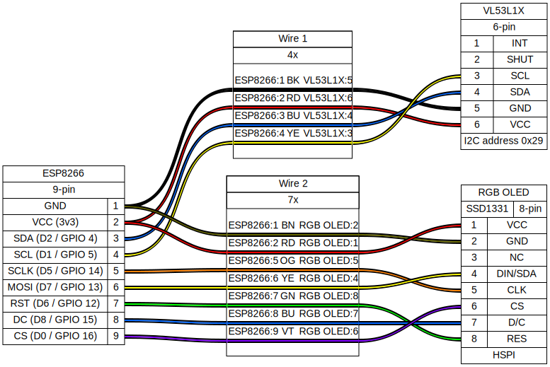

# mittarimato

A simple little real-time distance display for ESP8266.

## Hardware

- Distance sensor: [Waveshare time-of-flight sensor (VL53L1X)](
  https://www.waveshare.com/vl53l1x-distance-sensor.htm). Connected to I2C
  port 0, address 0x29.
- Display: [Waveshare 0.95inch RGB OLED (SSD1331)](
  https://www.waveshare.com/wiki/0.95inch_RGB_OLED_(B)). Connected over HSPI.



## Compiling

```sh
$ . ./env
$ cmake -B build
$ ninja -C build flash
$ ./monitor
```