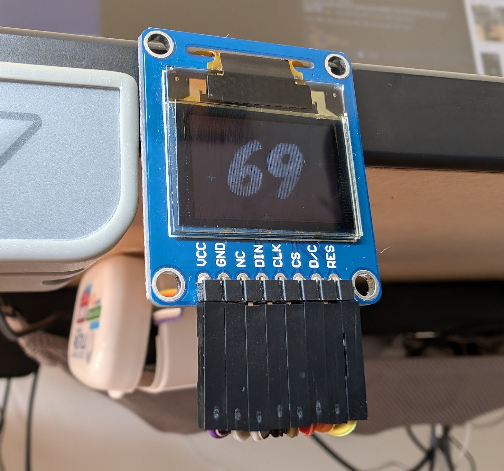
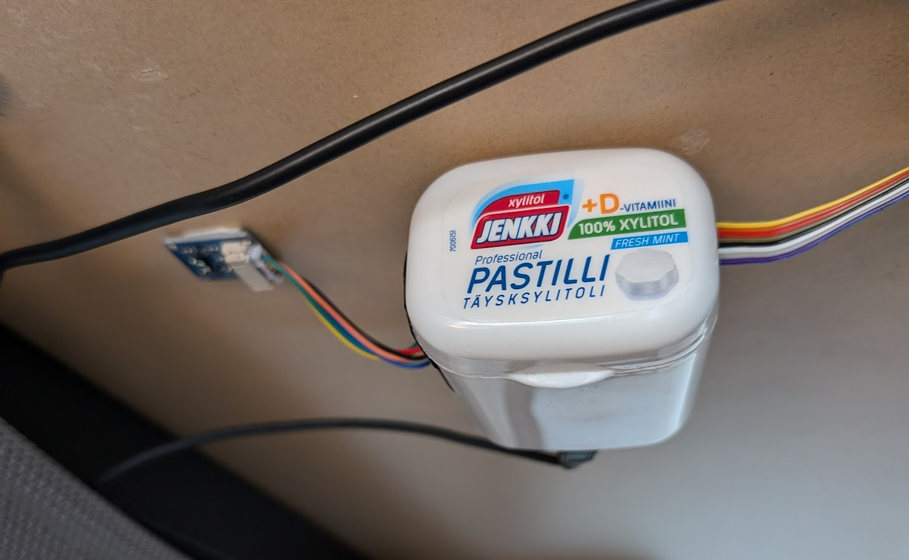

# Mittarimato



This is a little distance display built with an ESP8266, a time-of-flight sensor
and an RGB OLED screen. I'm using it to display the height of my standing desk.

Demo video:

<video src="assets/mittarimato.mp4" controls></video>

## Hardware



- CPU: [IZOKEE NodeMCU ESP8266 module](https://www.amazon.com.au/IZOKEE-ESP8266-IoT-Module-Kit/dp/B087G8DFXC).
- Distance sensor: [Waveshare time-of-flight sensor (VL53L1X)](
  https://www.waveshare.com/vl53l1x-distance-sensor.htm). Connected to I2C
  port 0, address 0x29.
- Display: [Waveshare 0.95inch RGB OLED (SSD1331)](
  https://www.waveshare.com/wiki/0.95inch_RGB_OLED_(B)). Connected over HSPI.

Wiring diagram:


## Software

The main pieces of the software are:

- `distance_sensor.cc`: Sensor driver, which provides the distance measurement.
- `rainbow_fx.cc`: Palette-based graphics effects and 2x antialised text rendering.
- `display.cc`: SPI display driver.
- `main.cc`: Main measurement and rendering loop.

On my hardware, the animation updates at about 50 fps.

First, install the [ESP8266
SDK](https://docs.espressif.com/projects/esp8266-rtos-sdk/en/latest/get-started/index.html).
Update the `env` file with the path to your SDK installation.

After that, you can build and flash the program like this:

```sh
$ . ./env
$ cmake -B build
$ ninja -C build flash
$ ./monitor
```